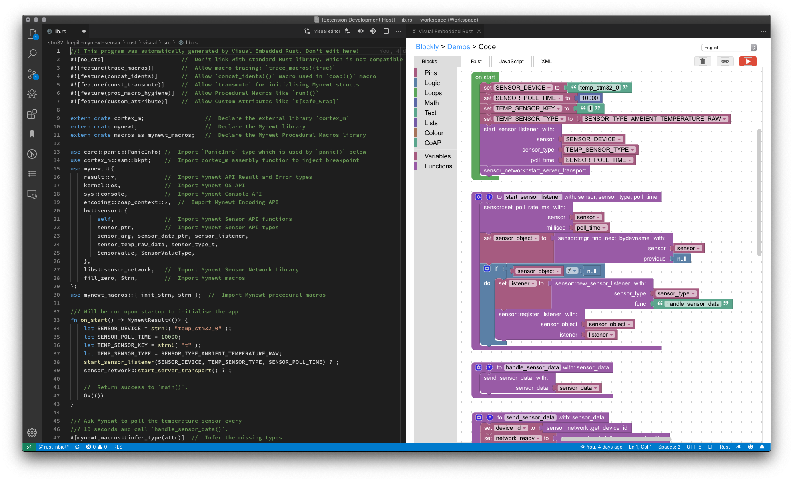

# visual-embedded-rust

Create and edit Embedded Rust programs visually by dragging and dropping blocks

## Features

Watch the demo: https://youtu.be/jYo8B8c7T3Y

Read the articles...

1. [_"Rust Rocks NB-IoT! STM32 Blue Pill with Quectel BC95-G on Apache Mynewt"_](https://medium.com/@ly.lee/rust-rocks-nb-iot-stm32-blue-pill-with-quectel-bc95-g-on-apache-mynewt-ef62a7e28f7e)

1. [_"Visual Programming with Embedded Rust? Yes we can with Apache Mynewt and Google Blockly!"_](https://medium.com/@ly.lee/visual-programming-with-embedded-rust-yes-we-can-with-apache-mynewt-and-google-blockly-8b67ef7412d7)

## Usage

1. In the Visual Studio Code Explorer, create a new empty Rust source file like `main.rs`

1. Edit the Rust file

1. Click `Visual Editor` at the top right of the editor

1. When prompted to populate the visual program into the Rust source file, click `OK`

1. Click the Rust source file to see the generated Rust code. Save the file to save the visual program.



## Inside The Extension

The source code is located at [`github.com/lupyuen/visual-embedded-rust`](https://github.com/lupyuen/visual-embedded-rust)

1. Main logic for the VSCode Extension is in [`extension.ts`](src/extension.ts)

1. The extension creates a [WebView that embeds the HTML code](src/extension.ts#L88-L144) from Google Blockly. [HTML code is here](src/web.ts)

1. The VSCode Extension and the WebView are running in [separate JavaScript sandboxes](https://code.visualstudio.com/api/extension-guides/webview#scripts-and-message-passing). Hence we'll be using VSCode Message Passing to communicate between the VSCode Extension and WebView, as we shall soon see...

1. [When the WebView loads](media/vscode/storage.js#L59-L71), it fetches the [Blockly XML embedded](src/extension.ts#L155-L202) in the Rust document in VSCode and [notifies the Webview (via Message Passing)](src/extension.ts#L168-L186) to [refresh the Blockly workspace](media/vscode/message.js#L40-L60)

1. When the [visual program is updated](media/vscode/storage.js#L165-L194), the WebView sends the [updated Blockly XML and the generated Rust code (via Message Passing)](media/vscode/message.js#L79-L89) to the VSCode Extension.  The extension [updates the Rust document](src/extension.ts#L203-L223) in VSCode with the Blockly XML and generated Rust Code.

1. The Rust code generator for Blockly is here: [blockly-mynewt-rust](https://github.com/lupyuen/blockly-mynewt-rust/tree/master/generators/rust)

1. [Demo Rust source file is here](https://github.com/lupyuen/stm32bluepill-mynewt-sensor/blob/rust-nbiot/rust/visual/src/lib.rs)

The extension is [published here](https://marketplace.visualstudio.com/items?itemName=LeeLupYuen.visual-embedded-rust)

## Building The Extension

To build the extension, two repositories need to be cloned into the `media` folder: [blockly-mynewt-rust](https://github.com/lupyuen/blockly-mynewt-rust) and [closure-library](https://github.com/google/closure-library):

```bash
cd media
git clone https://github.com/lupyuen/blockly-mynewt-rust
git clone https://github.com/google/closure-library
```