# visual-embedded-rust

- Create and edit Embedded Rust programs visually by dragging and dropping blocks

- Generates Embedded Rust code for [STM32 Blue Pill](https://medium.com/swlh/super-blue-pill-like-stm32-blue-pill-but-better-6d341d9347da?source=friends_link&sk=956087171b9b9efcc484ea60b9c78c16) with [Apache Mynewt](https://mynewt.apache.org/) realtime operating system

# Features

Watch the demo...

[微博视频](https://weibo.com/7285313566/I2MWZ1CnK)

[YouTube Video](https://youtu.be/ytGa-7q6sqY)

Read the articles...

1. [_"Visual Embedded Rust Programming with Visual Studio Code"_](https://medium.com/@ly.lee/visual-embedded-rust-programming-with-visual-studio-code-1bc1262e398c?source=friends_link&sk=222de63e45993aacd0db5a2e4b1f33c7)

1. [_"Advanced Topics for Visual Embedded Rust Programming"_](https://medium.com/@ly.lee/advanced-topics-for-visual-embedded-rust-programming-ebf1627fe397?source=friends_link&sk=01f0ae0e1b82efa9fd6b8e5616c736af)

1. [_"Rust Rocks NB-IoT! STM32 Blue Pill with Quectel BC95-G on Apache Mynewt"_](https://medium.com/@ly.lee/rust-rocks-nb-iot-stm32-blue-pill-with-quectel-bc95-g-on-apache-mynewt-ef62a7e28f7e?source=friends_link&sk=aaa21371f68a07c543066b6b89a760f0)

1. [_"Visual Programming with Embedded Rust? Yes we can with Apache Mynewt and Google Blockly!"_](https://medium.com/@ly.lee/visual-programming-with-embedded-rust-yes-we-can-with-apache-mynewt-and-google-blockly-8b67ef7412d7?source=friends_link&sk=353fb92b6f20ebf885ff5c9be44fd6f2)


# Document Contents

1. Usage

1. Build The Firmware

1. Connect The Hardware

1. Flash The Firmware To Blue Pill

1. Run The Program

1. Function 1: On Start

1. Function 2: Start Sensor Listener

1. Function 3: Handle Sensor Data

1. Function 4: Send Sensor Data

1. Rust Source Files

1. Program Settings

1. CoAP: Constrained Application Protocol

1. Quectel NB-IoT AT Commands

1. Configuring the CoAP Server at thethings.io

1. Typeless Rust

1. How Small Is Rust?

1. Why Blue Pill? Power vs Price Compromise

1. Why Apache Mynewt? Evolution of Rust on Bare Metal

1. How Safe Is Rust? Safe Wrappers for Mynewt

1. Inside The Visual Embedded Rust Extension for Visual Studio Code

1. Building The Visual Embedded Rust Extension

1. References

1. Release Notes

# Usage

1. In Visual Studio Code, Click `File → Open` to open any folder

    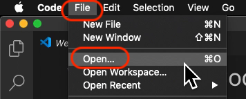

1. In the `Explorer → (Folder Name)` pane at top left, create a new Rust source file, like `lib.rs`

    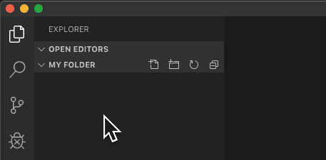

1. Edit the Rust source file. Click `Visual Editor` at top right

    

1. When prompted to populate the visual program into the Rust source file, click `OK`

    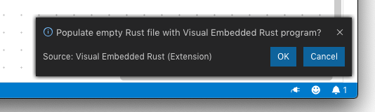

1. Click the Rust source file to see the generated Rust code. Save the file to save the visual program. Don't edit the Rust source file manually, always use the visual editor.

[Sample Rust source file containing generated Rust code and XML blocks](https://github.com/lupyuen/stm32bluepill-mynewt-sensor/blob/rust-nbiot/rust/visual/src/lib.rs)


# Build The Firmware

To compile the generated Rust program into Blue Pill firmware...

1. Click here to install `Build Tools For Visual Studio 2019`: <br>
    https://visualstudio.microsoft.com/downloads/#build-tools-for-visual-studio-2019

1. Click the `Individual Components` tab

    Select the following components: <br>
    `Windows 10 SDK (10.0.18362.0)` <br>
    `C++ CMake Tools for Windows` <br>
    (This should be automatically selected) `MSVC v142 — VS 2019 C++ x64/x86 Build Tools`

    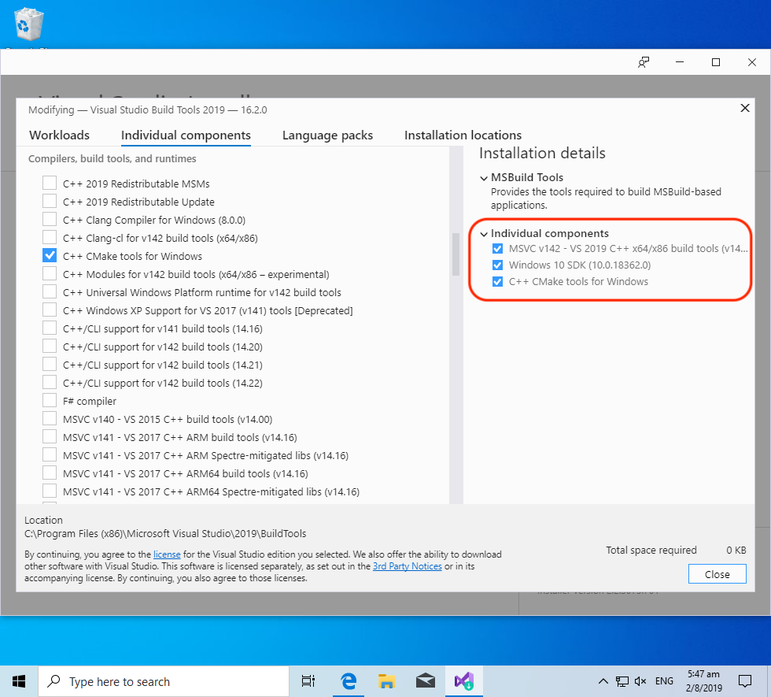

1. Install rustup according to the instructions here: <br>
    https://rustup.rs

    Click the link provided to download `rustup‑init.exe` <br>
    Launch the downloaded file `rustup‑init.exe` <br>

    If you see the message `Windows Defender SmartScreen prevented an unrecognised app from starting`… <br>
    Click `More Info` <br>
    Click `Run Anyway` <br>

    At the `Welcome to Rust!` prompt, press Enter to select the default option: <br>
    `1) Proceed with installation (default)`

1. Open the Windows Command Prompt. Enter into the command prompt:

    ```
    rustup default nightly
    rustup update
    rustup target add thumbv7m-none-eabi
    rustc -V
    ```

    The reported version of rustc should be 1.38.0 or later: <br>
    `rustc 1.38.0-nightly (435236b88 2019–08–01)`

1. Download the `stm32bluepill-mynewt-sensor.7z` file attached below… <br>
    https://github.com/lupyuen/stm32bluepill-mynewt-sensor/releases/tag/v7.0.3

    Expand the `.7z` file with 7zip… <br>
    https://www.7-zip.org/download.html

1. Install Arm Cross-Compiler and Linker for Windows from Arm Developer Website… <br>
    https://developer.arm.com/-/media/Files/downloads/gnu-rm/8-2019q3/RC1.1/gcc-arm-none-eabi-8-2019-q3-update-win32-sha1.exe?revision=fcadabed-d946-49dc-8f78-0732d2f43773?product=GNU%20Arm%20Embedded%20Toolchain,32-bit,,Windows,8-2019-q3-update

    Select this option at the last install step: <br>
    `Add path to environment variable`

1. Download the ST-Link USB driver from ST-Link Driver Website (email registration required)… <br>
    https://www.st.com/en/development-tools/stsw-link009.html

    Click `Get Software` <br>
    Unzip the downloaded file. Double-click the driver installer: <br>
    `dpinst_amd64.exe`

1. Launch Visual Studio Code <br>
    Install the extension “Cortex-Debug”… <br>
    https://marketplace.visualstudio.com/items?itemName=marus25.cortex-debug

1. Click `File → Open Folder`

    Select the downloaded folder `stm32bluepill-mynewt-sensor`

    When prompted to open the workspace, click `Open Workspace`

    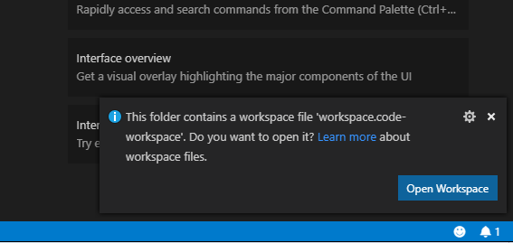

1. Copy your Visual Program source file to `stm32bluepill-mynewt-sensor/rust/app/src/lib.rs`. Overwrite the existing file.

    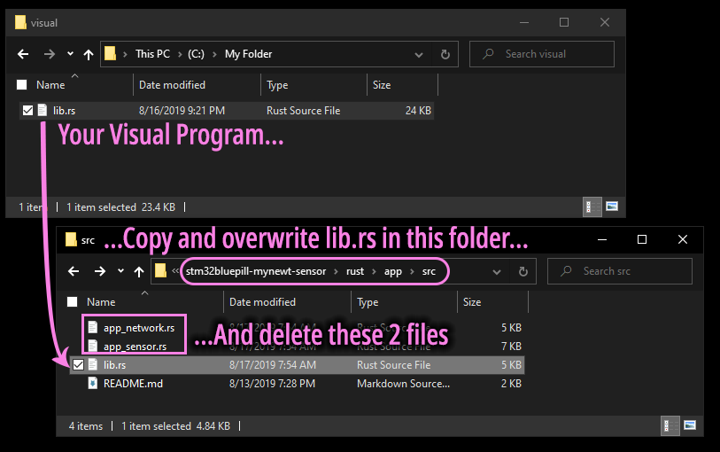

1. Delete the files `app_network.rs` and `app_sensor.rs` in that folder

1. If you have a Quectel NB-IoT module… <br>

    Open the following file and configure the program settings: <br>
    `targets/bluepill_my_sensor/syscfg.yml` <br>
    Change the NB-IoT band setting `NBIOT_BAND`. Check with your NB-IoT operator for the band to use.

1. Click `Terminal → Run Task → [1] Build bluepill_boot`

    This builds the bootloader, which starts the Apache Mynewt operating system upon startup. If it shows errors, [compare with this build log](https://github.com/lupyuen/stm32bluepill-mynewt-sensor/blob/rust-nbiot/logs/build-bootloader.log).

1. Click `Terminal → Run Task → [2] Build bluepill_my_sensor`

    This builds the firmware containing our Rust program. [Compare with this build log](https://github.com/lupyuen/stm32bluepill-mynewt-sensor/blob/rust-nbiot/logs/build-application.log).

    When our Rust program has been successfully compiled as Blue Pill ROM firmware, we should see this…

    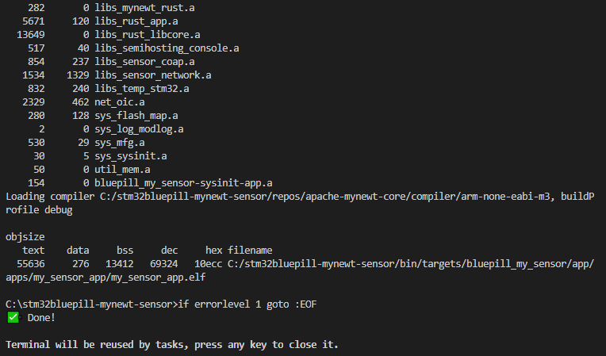

1. Click `Terminal → Run Task → [3] Image bluepill_my_sensor`

    This creates the Blue Pill flash image from the firmware. [Compare with this image log](https://github.com/lupyuen/stm32bluepill-mynewt-sensor/blob/rust-nbiot/logs/image.log)

    If any source files or configuration files are changed, rebuild the application by clicking <br>
    `Terminal → Run Task → [2] Build bluepill_my_sensor`

# Connect The Hardware

| | |
|:- |:- |
| 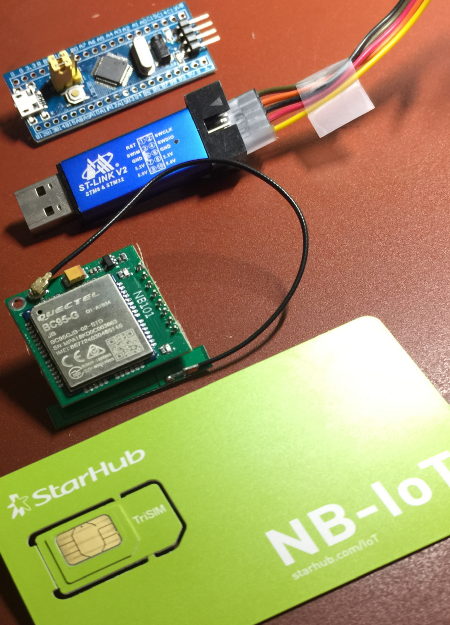 <br> _From top to bottom: STM32 Blue Pill, ST-Link V2, Quectel BC95-G breakout board with antenna, NB-IoT SIM_  | We’ll need the following hardware… <br><br> [1] __STM32 Blue Pill:__ Under $2, search [AliExpress](https://www.aliexpress.com/wholesale?catId=0&initiative_id=SB_20180924131057&SearchText=stm32f103c8t6+development+board&switch_new_app=y) for `stm32f103c8t6 development board` <br><br> [2] __ST-Link V2 USB Adapter:__ Under $2, search [AliExpress](https://www.aliexpress.com/wholesale?catId=0&initiative_id=SB_20180924134644&SearchText=st-link+v2&switch_new_app=y) for `st-link v2` <br><br> __Optional:__ To transmit data to the NB-IoT network, we’ll also need… <br><br> [3] __Quectel BC95-G Global NB-IoT Module__ ([breakout board with antenna](https://www.aliexpress.com/wholesale?catId=0&initiative_id=SB_20190725022150&SearchText=bc95-g+nb101&switch_new_app=y)) <br><br> I ordered mine [from Taobao](https://item.taobao.com/item.htm?id=577310122904). [The manual in Chinese is here](http://rs.iotxx.com/uploads/doc/%E8%B0%B7%E9%9B%A8NB10x%E4%BD%BF%E7%94%A8%E8%AF%B4%E6%98%8E%E4%B9%A6-V1.3.pdf). <br><br> BC95-G works in all NB-IoT frequency bands worldwide. If you’re buying a different NB-IoT module, check that it supports your local NB-IoT Frequency Band. (For example: In Singapore I’m using NB-IoT Frequency Band 8 with StarHub) <br><br> [4] __NB-IoT SIM__ from your local NB-IoT network operator <br><br> Many thanks to [StarHub](https://www.starhub.com/) for sponsoring the NB-IoT SIM that I used for this tutorial!
 |

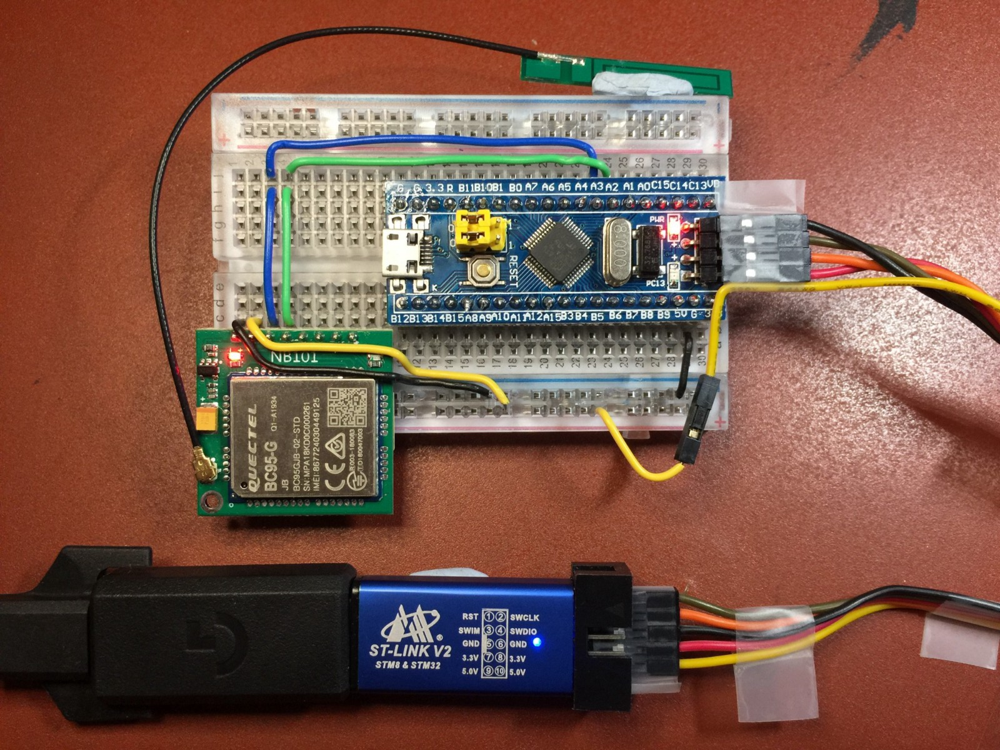

Connect Blue Pill to Quectel BC95-G and ST-Link as follows…

| Blue Pill          | Quectel BC95-G | ST-Link V2        | Wire Colour |
| :---               | :---           | :---              | :---        |
| `PA2 (UART2 TX2)`  | `RXD (Pin 4)`  |                   | Green  |
| `PA3 (UART2 RX2)`  | `TXD (Pin 3)`  |                   | Blue   |
| `GND`              | `GND (Pin 1)`  |                   | Black  |
|                    | `VCC (Pin 2)`  | `5.0V   (Pin 10)` | Yellow |
| `3V3`              |                | `3.3V   (Pin 8)`  | Red    |
| `DIO`              |                | `SWDIO  (Pin 4)`  | Orange |
| `DCLK`             |                | `SWDCLK (Pin 2)`  | Brown  |
| `GND`              |                | `GND    (Pin 6)`  | Black  |

Both yellow jumpers on Blue Pill should be set to the 0 position, as shown in the above photo.

|           | | 
| :-               | :-           |
| 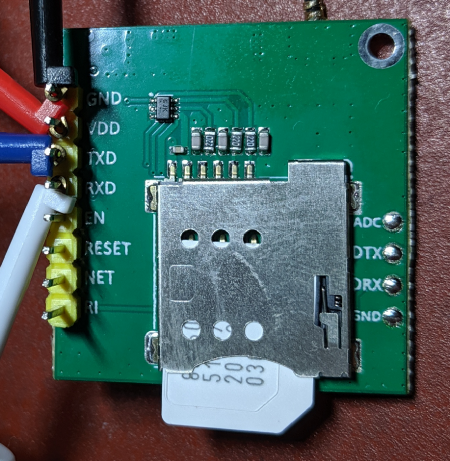 <br> _SIM partially exposed to show the unusual orientation_ | Note that we are powering the Quectel module with __5V from ST-Link instead of 3.3V from Blue Pill__. That’s because the module requires more power than Blue Pill can provide. (How did I find out? Because the module kept restarting when I powered it from Blue Pill.) <br><br> __Check the documentation for your Quectel breakout board to confirm that it supports 5V__. ([Mine does](http://rs.iotxx.com/uploads/doc/%E8%B0%B7%E9%9B%A8NB10x%E4%BD%BF%E7%94%A8%E8%AF%B4%E6%98%8E%E4%B9%A6-V1.3.pdf)) <br><br> __Insert the NB-IoT SIM__ according to the orientation shown in the photo. (Yes the SIM notch faces outward, not inward). <br><br> _Remember: Always connect the antenna before powering up the NB-IoT module!_  <br><br> __If you’re using Windows:__ Make sure that the ST-Link Driver has been installed before connecting ST-Link to your computer
  | 

# Flash The Firmware To Blue Pill

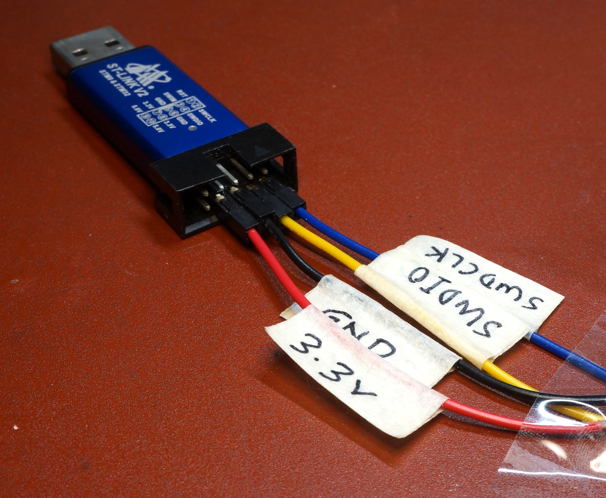

1. Check that the Blue Pill is connected to ST-Link… <br>
    And that the ST-Link is connected to your computer’s USB port. <br>
    Now let’s head back to Visual Studio Code…

1. Click `Terminal → Run Task → [4] Load bluepill_boot`

    This flashes the bootloader to Blue Pill, to start the Apache Mynewt operating system upon startup. If it shows errors, [compare with this flash log](https://github.com/lupyuen/stm32bluepill-mynewt-sensor/blob/rust-nbiot/logs/load-bootloader.log).

1. Click `Terminal → Run Task → [5] Load bluepill_my_sensor`

    This flashes the firmware (containing our Visual Program) to Blue Pill. If it shows errors, [compare with this flash log](https://github.com/lupyuen/stm32bluepill-mynewt-sensor/blob/rust-nbiot/logs/load-application.log).

# Run The Program

1. Click `Debug → Start Debugging`

1. Click `View → Output`

    Select `Adapter Output` to see the Blue Pill log

    

1. The debugger pauses at the line with `LoopCopyDataInit`

    Click `Continue` or press `F5`

    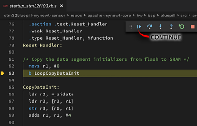

1. The debugger pauses next at the `main()` function.

    Click `Continue` or press `F5`

    

Our Blue Pill should now poll its internal temperature sensor every 10 seconds. It should also transmit the temperature data to the CoAP server hosted at thethings.io.

[The Blue Pill log should look like this](https://github.com/lupyuen/stm32bluepill-mynewt-sensor/blob/rust-nbiot/logs/visual.log). The log is explained below in the _"Quectel NB-IoT AT Commands"_ section.

[微博视频](https://weibo.com/7285313566/I2MZOeP0F)

[YouTube Video](https://youtu.be/PL4Yj3IS5ck)

Upon clicking the URL `https://blue-pill-geolocate.appspot.com/?device=5cfca8c…` that’s shown in the Blue Pill log, we’ll see a web page that displays the temperature received by the server at thethings.io.

The server has converted the raw temperature into degrees Celsius. We convert the temperature at the server to conserve RAM and ROM on Blue Pill.

 <br>
_Display of sensor data received from our Blue Pill_

# Function 1: On Start

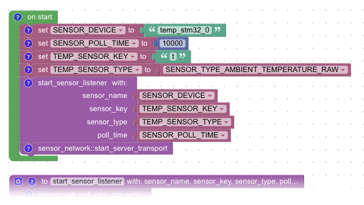

`On Start` marks the start of the program. Here we define some constants — values used by the program that won’t change as the program runs…

1. `SENSOR_DEVICE` is the name of the sensor that the program will poll (check periodically). We’ll be polling Blue Pill’s Internal Temperature Sensor, which is named `temp_stm32_0`

1. `SENSOR_POLL_TIME` is the time interval (in milliseconds) for polling the sensor. We’ll set this to 10 seconds (or 10,000 milliseconds)

1. `TEMP_SENSOR_KEY` is the name of the sensor data field that our program will send to the server. We’ll call it `t` to tell the server we’re sending a temperature value.

1. `TEMP_SENSOR_TYPE` is the type of sensor data that our program will send: Raw ambient temperature in whole numbers (integers from 0 to 4095), hence `SENSOR_TYPE_AMBIENT_TEMPERATURE_RAW`

Why do we send the temperature in raw form instead of the usual decimal (floating-point) form like 28.9 degrees Celsius? That’s because Blue Pill has very limited RAM and ROM. Sending the raw temperature without conversion will save us from reserving RAM and ROM that would be needed for the floating-point conversion. We’ll let the server convert instead.

By Rust convention, constants are named in uppercase. Hence we name the constants as `SENSOR_DEVICE` instead of sensor_device

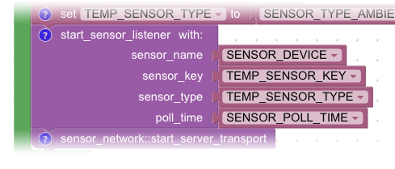

Next we call the function `start_sensor_listener` to begin polling the temperature sensor every 10 seconds. More about this in the next section.

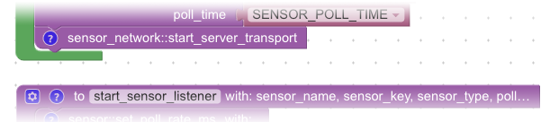

Finally we call `start_server_transport`, which is a system function defined in the `sensor_network` library. This function starts a background task to establish a connection to the NB-IoT network. For this tutorial, we’ll be transmitting sensor data over the NB-IoT network, which is available worldwide.

It may take a few seconds to complete, but the function executes in the background so it won’t hold up other tasks, like polling the temperature sensor.

Take note of the Rust convention… `sensor_network::start_server_transport` refers to the function `start_server_transport` that’s found inside the Rust Library `sensor_network`. Rust Libraries are also known as “Crates”.

How was the `On Start` function created?
By dragging and dropping the blocks from the Blocks Bar at the left of the Visual Program.
That’s how we create a Visual Program… By arranging the blocks to compose a program!

[微博视频](https://weibo.com/7285313566/I2MOamxS9)

[YouTube Video](https://youtu.be/Qw1N-01PAy8)


# Function 2: Start Sensor Listener

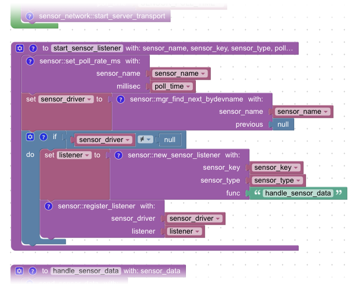

`To start_sensor_listener With ...` is the way that we define functions in the Visual Program. Here we define `start_sensor_listener` as a function that accepts 4 parameters (or inputs), whose values we have seen from the previous section…

1. `sensor_name`: Name of the sensor to be polled. Set to `SENSOR_DEVICE` (i.e. `temp_stm32_0`)

1. `sensor_key`: Name of the sensor data field to be sent to the server. Set to `TEMP_SENSOR_KEY` (i.e. `t`)

1. `sensor_type`: Type of sensor data that will be sent to the server. Set to `SENSOR_TYPE_AMBIENT_TEMPERATURE_RAW`

1. `poll_time`: Time interval (in milliseconds) for polling the sensor. Set to `SENSOR_POLL_TIME` (i.e. 10,000 milliseconds or 10 seconds)


Next we call the system function `set_poll_rate_ms`, defined in the `sensor` library. The `sensor` library comes from the Apache Mynewt operating system, which manages all sensors on Blue Pill.

By calling the function `set_poll_rate_ms` with `sensor_name` set to `temp_stm32_0` and `poll_time` set to `10000` (milliseconds), we are asking the system to poll the temperature sensor every 10 seconds. And the system will happily fetch the temperature value on our behalf every 10 seconds.

What shall we do with the temperature value? We’ll define a Listener Function to transmit the data. But first…

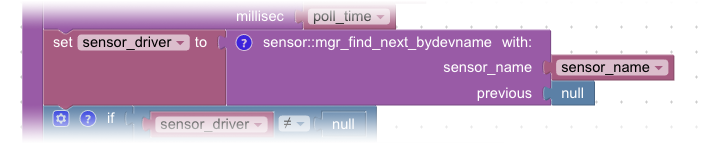

We call function `mgr_find_next_bydevname` (also from the `sensor` library) to fetch the sensor driver from the system and store it in the variable `sensor_driver`. By passing the `sensor_name` as `temp_stm32_0`, the function returns the driver responsible for managing the temperature sensor. The driver will be used for setting the Listener Function in a while.

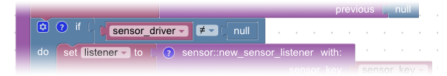

Before that, we check the sensor driver was actually found. If we had misspelt the name of the sensor, the sensor driver would not be found and it would be set to `null`, a special Rust value that means “nothing”. Hence we check to ensure that `sensor_driver` is not `null`.

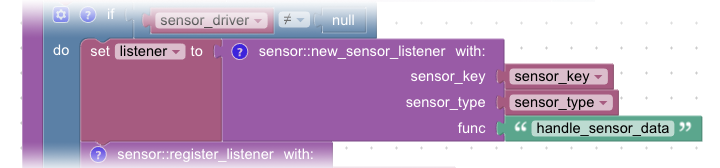

We create a sensor listener (stored as `listener`) by calling the system function `new_sensor_listener`, passing in the `sensor_key` (set to `t`) and the `sensor_type` (raw ambient temperature). func is the name of the Listener Function that will be called after reading the sensor data: `handle_sensor_data`. Which we’ll cover in the next section.

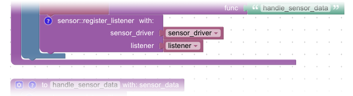

To register the Listener Function in the system, we call the system function `register_listener`, passing in the `sensor_driver` and the sensor listener that we have just created.

After that, the operating system will automatically read the temperature sensor every 10 seconds and call our function `handle_sensor_data` with the temperature value.

[微博视频](https://weibo.com/7285313566/I2MWZ1CnK)

[YouTube Video](https://youtu.be/ytGa-7q6sqY)

# Function 3: Handle Sensor Data

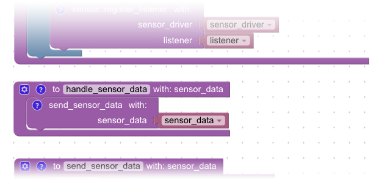

How shall we handle the temperature data that has been read? `handle_sensor_data` passes the sensor data to another function `send_sensor_data` that transmits the sensor data to the server. More about `send_sensor_data` in a while.

The function `handle_sensor_data` doesn’t seem to do much… why did we design the program this way? It’s meant for future expansion — when we need more complicated logic for handling sensor data, we’ll put the logic into `handle_sensor_data`

`handle_sensor_data` could be extended to handle multiple sensors, aggregating the sensor data before transmitting. Or it could check for certain conditions and decide whether it should transmit the data. This program structure gives us the most room to expand for the future.

# Function 4: Send Sensor Data

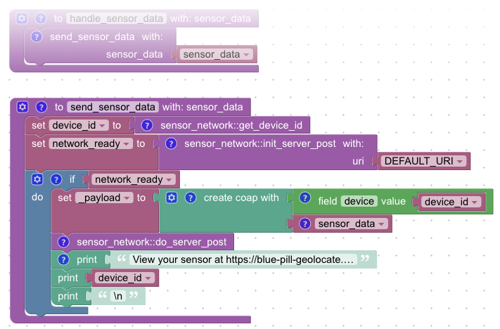

The final function in our program, `send_sensor_data`, is called by `handle_sensor_data` to transmit sensor data. The parameter `sensor_data` contains the field name `t` and the sensor value, like `1715`. Remember that this is a raw temperature value. The server will convert the raw value to degrees Celsius later.

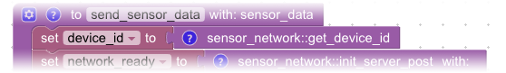

We call `get_device_id` from the `sensor_network` library to fetch the Device ID from the system. This is a long string of random letters and digits like `a8b2c7d8e9b2...` Each time we restart Blue Pill we’ll get a different Device ID. We’ll use this Device ID later to identify our Blue Pill uniquely and check whether the server has received the temperature sensor data from our Blue Pill.

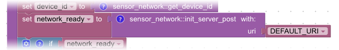

Next we call `init_server_post` (also from `sensor_network` library) to prepare a sensor data message that will be sent to the server. Because Blue Pill has limited RAM, this function will ensure that only one task is allowed to compose messages at any time. The other tasks will have to wait for their turn.

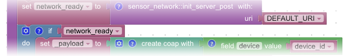

`init_server_post` returns a true/false result (known as a boolean) that indicates whether the NB-IoT network connection has been established. This stored in the variable `network_ready`.

Only when `network_ready` is true, which means that the device has connected to the NB-IoT network, then we proceed to compose a CoAP Message.

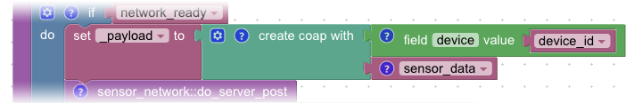

What’s a CoAP Message? It’s a standard format for transmitting sensor data over NB-IoT. Here we are transmitting two data values in the CoAP Message...

1. `device_id`: The randomly-generated Device ID that uniquely identifies our Blue Pill. This field shall be transmitted with the field name device

1. `sensor_data`: Contains the field name `t` and the sensor value, like `1715`

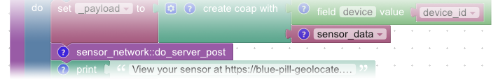

The CoAP Message is transmitted only when function `do_server_post` is called. Again this transmission takes place in a background task, so it won’t hold up our program from polling the sensor.

Notice that `_payload` is named differently… it begins with an underscore `_`. By Rust convention, variables that are set but not read should be named with an underscore `_` as the first character. Because the Rust Compiler will warn us about unused variables.

This effectively tells the Rust Compiler: _“Yes I’m setting the variable `_payload` and I’m not using the value… Please don’t warn me that I may have misspelt the name `_payload`"_

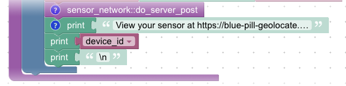

At the end of the function, we display a URL in the Blue Pill log that contains the Device ID. The URL looks like this: https://blue-pill-geolocate.appspot.com/?device=5cfca8c…
We’ll click this URL to verify that the server has received our sensor data.

# Rust Source Files

| | |
|:- |:- |
| 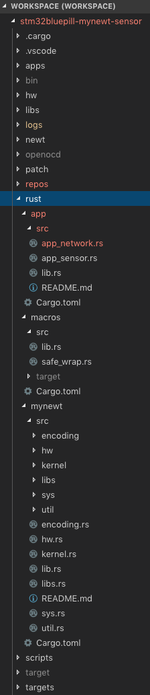 | The Rust source files are located in the `rust` folder… <br><br> `rust/app`: Rust application that polls the internal temperature sensor and transmits the sensor data over NB-IoT <br><br> If you’re using Visual Embedded Rust... <br><br> Overwrite the file `src/lib.rs` by your Visual Program source file <br><br> Delete `app_network.rs` and `app_sensor.rs` in the src folder. <br><br> Rebuild the application by clicking <br><br>  `Terminal → Run Task → [2] Build bluepill_my_sensor` <br><br> `rust/visual`: Sample Visual Embedded Rust program <br><br> `rust/mynewt`: Rust Safe Wrappers for Mynewt OS and libraries <br><br> `rust/macros`: Rust Procedural Macros for generating Safe Wrappers, inferring types and other utility macros like `strn!()` 
 |

# Program Settings

The program settings may be found in the file
[targets/bluepill_my_sensor/syscfg.yml](https://github.com/lupyuen/stm32bluepill-mynewt-sensor/blob/nbiot/targets/bluepill_my_sensor/syscfg.yml)

`COAP_HOST, COAP_PORT`: The program will send CoAP messages to this IP address and port number, which defaults to the CoAP server at thethings.io.
Keep the default settings if you wish to view your sensor data at blue-pill-geolocate.appspot.com.
Change the setting to use your own CoAP server instead of thethings.io

`COAP_URI`: The CoAP message will be delivered to this URI at the CoAP server (which defaults to `coap.thethings.io`).

Keep the default settings if you wish to view your sensor data at blue-pill-geolocate.appspot.com.

For thethings.io, the last part `IVRi… `is the Thing Token. If you wish to send sensor data to your own Thing at thethings.io, replace the last part of the URI with your Thing Token.

For the purpose of NB-IoT Education, I’ll allow you to transmit sensor data to the Thing Token IVRi… from my personal, paid thethings.io account. Which will forward the sensor data to `blue-pill-geolocate.appspot.com` for viewing.

`NBIOT_BAND`: The program connects to this NB-IoT Frequency Band. The Frequency Band depends on your country and your NB-IoT network operator. Check with your NB-IoT network operator for the Frequency Band to use.

# CoAP: Constrained Application Protocol

_Note: The example below assumes that our device is transmiiting the temperature as a floaing-point value like `tmp: 28.9`. However our Visual Embedded Rust program transmits the temperature as a raw integer like `t: 1879`. Please do the necessary mental adjustments_

## Are You Connected? Or Connectionless?


How do we achieve “low cost, long battery life, and high connection density” with NB-IoT? Next time you attend a party, try this…

Mingle around as many people as you can. Listen to what EVERYONE has to say.

When a conversation gets boring, just move away without saying anything.

Don’t feel obligated to continue any conversation. It’s your right to listen as much or as little as you want. You’re NOT committed to stay CONNECTED to any person at the party.

Yes your friends will find you strangely anti-social. You will miss out on some great stories from your friends, but then again, they are probably repeating the same old stories.

BUT you will learn lots more, from more people. And feel less drained.

That’s the better way… the CONNECTIONLESS way!

We have been using TCP (Transmission Control Protocol) since the beginning of the internet to connect our gadgets (HTTP and MQTT are two popular protocols based on TCP). However TCP is Connection-Oriented — when two devices are connected via TCP, they need to stay connected… or they will be penalised.

If any packets are dropped (due to poor network coverage or congestion) or delayed, both devices will need to resynchronise their TCP windows by retransmitting their packets. Which may lead to severe problems like the MQTT Server congestion on Moon Base One!

## The Connectionless Way: Change TCP to UDP

In a Connectionless Network there’s no commitment to stay connected to any device: Just transmit or receive a message. And move on. (Like our Connectionless Party!)


Instead of establishing a TCP connection, we transmit a UDP (User Datagram Protocol) packet without waiting for the acknowledgement. 

But because they are Connectionless, UDP packets do not enjoy guaranteed delivery.

Most UDP packets are delivered properly, but if any packets are dropped (due to poor network coverage or congestion), UDP devices don’t attempt to resynchronise and retransmit the lost packets.

Isn’t it a serious problem when packets disappear in our IoT network? Well, do we really need to receive every single sensor reading? Instead of suffering a server failure or network congestion, could we compromise by dropping a couple of sensor messages? That’s how we achieve High Connection Density in NB-IoT!

When we go Connectionless, our gadgets become a lot simpler to build… no messy sliding window protocols and waiting forever! Thus our NB-IoT gadgets are Low Cost, and enjoy Long Battery Life!

💎 Many other things are switching to the simpler Connectionless way… 1️⃣ HTTP version 3 will switch from TCP to a UDP protocol named QUIC. Because it just works better on lossy mobile networks. 2️⃣ YouTube and many video streaming services are already running on RTSP based on UDP. It allows video quality to be negotiated in real time based on network conditions. 3️⃣ Most massively multiplayer games already use UDP to achieve lower latency.

## Hello CoAP!


In the Connection-Oriented Universe, we have the MQTT protocol for transmitting TCP sensor messages to the IoT Server. What’s the equivalent for the Connectionless Universe that will allow us to transmit UDP sensor messages?

_Answer_: __[Constrained Application Protocol, or CoAP](https://en.wikipedia.org/wiki/Constrained_Application_Protocol)__

Why “Constrained”? Because CoAP was designed for low-power microcontrollers that don’t have easy access to power (like the crop sensors on Moon Base One). And CoAP requires little bandwidth… 120 bytes is all we need to send a sensor message to a CoAP server (like thethings.io)… Perfect for NB-IoT!

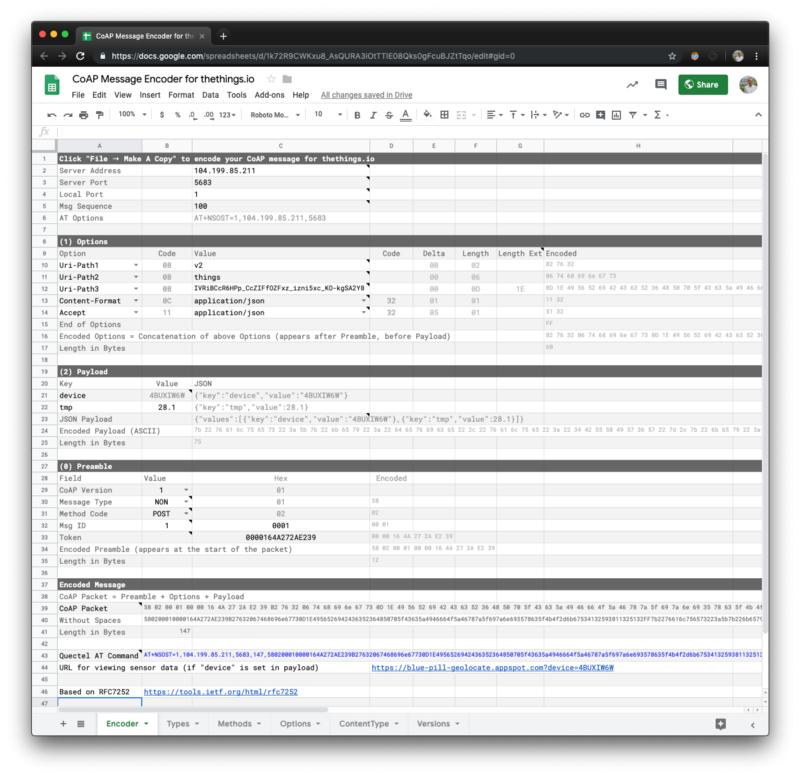 <br> 
[_Google Sheet for encoding CoAP messages_](https://docs.google.com/spreadsheets/d/1k72R9CWKxu8_AsQURA3iOtTTlE08Qks0gFcuBJZtTqo/edit?usp=sharing)

I have prepared a [Google Sheet](https://docs.google.com/spreadsheets/d/1k72R9CWKxu8_AsQURA3iOtTTlE08Qks0gFcuBJZtTqo/edit?usp=sharing) that shows how a CoAP message is encoded for sending sensor data. 

Click the sheet and make your own copy.  

Let’s look at the three parts of a CoAP message…

0️⃣ __CoAP Preamble__

1️⃣ __CoAP Options__

2️⃣ __CoAP Payload__

## [0] CoAP Preamble

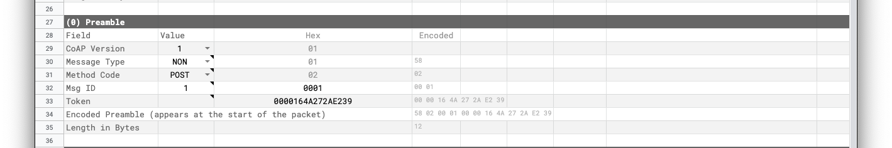 <br>
[CoAP Preamble](https://docs.google.com/spreadsheets/d/1k72R9CWKxu8_AsQURA3iOtTTlE08Qks0gFcuBJZtTqo/edit?usp=sharing)

The Preamble appears at the start of every CoAP message. The important parts are…

▶️ __Message Type__: `NON` is the recommended Message Type. `NON` messages don’t require any acknowledgement from the CoAP Server. So it’s highly efficient for transmitting sensor data and keeps the device firmware simple. If acknowledgement is desired (think very carefully!), select `CON` as the Message Type.

▶️ __Method Code__: `POST` will transmit sensor data to thethings.io. `GET` will fetch the last transmitted sensor value. Yes, CoAP follows the same conventions as HTTP and REST.

## [1] CoAP Options

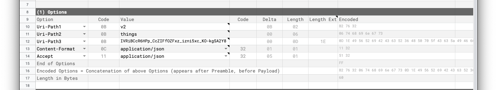 <br>
[_CoAP Options_](https://docs.google.com/spreadsheets/d/1k72R9CWKxu8_AsQURA3iOtTTlE08Qks0gFcuBJZtTqo/edit?usp=sharing)

After the Preamble, the Options section appears next. The Options will remind you of HTTP Headers…

▶️ __URI Path__: This is similar to the URL for HTTP requests. For thethings.io, each Thing is identified by a URI like…
v2/things/IVRiBCcR6HPp_CcZIFfOZFxz_izni5xc_KO-kgSA2Y8

The last gibberish part (IVRi…) is the Thing Token in thethings.io. More about that later.

▶️ __Content Format__: Here we tell the CoAP Server that our sensor data (the payload) is in JSON format

▶️ __Accept__: Here we tell the CoAP Server that the response from the server should also be in JSON format (if we’re expecting a response)

Note that Content Format and Accept fields each require only 1 byte 32 to specify the value `application/json`. Constrained and highly-efficient indeed!

## [2] CoAP Payload

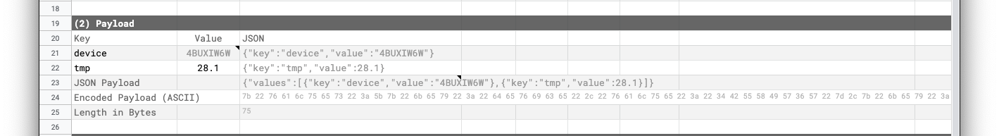 <br>
[_CoAP Payload_](https://docs.google.com/spreadsheets/d/1k72R9CWKxu8_AsQURA3iOtTTlE08Qks0gFcuBJZtTqo/edit?usp=sharing)

Finally we have the Payload, which contains the sensor data. Here we use a JSON document to encode the sensor values `device=4BUXIW6W, 
tmp=28.1`…

thethings.io requires the device to transmit sensor values in the above format: an array of values, with key and value in each entry.

thethings.io will look up the Thing that we have specified in the URI Options (`IVRi…`) and set the temperature `tmp` to `28.1`. 

What’s `device`? This the random Device ID that uniquely identifies our Blue Pill, so that we may view the sensor data received by the server.

How do we know where the Options end and where the Payload starts? Easy — just look for the End Of Options Marker `FF`. The CoAP format is so simple that it doesn’t need any fields to indicate the sizes of the Options and the Payload!

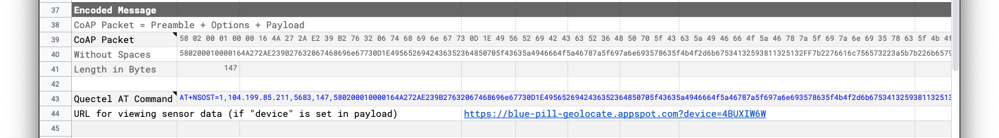 <br>
[_Encoded CoAP message_](https://docs.google.com/spreadsheets/d/1k72R9CWKxu8_AsQURA3iOtTTlE08Qks0gFcuBJZtTqo/edit?usp=sharing)

In under 150 bytes we have created a UDP message that our device may transmit over NB-IoT to update the sensor data for our Thing at thethings.io. We’ll learn next how to send this packet with a simple AT command.

For more details on CoAP, check the [CoAP specifications (RFC7252)](https://tools.ietf.org/html/rfc7252)

# Quectel NB-IoT AT Commands

We'll look at this [Blue Pill log](https://github.com/lupyuen/stm32bluepill-mynewt-sensor/blob/rust-nbiot/logs/visual.log) to understand the Quectel NB-IoT AT Commands sent by our Blue Pill to the Quectel BC95-G NB-IoT module...

Blue Pill connects to the Quectel module via the UART port at 9600 bps, 8 data bits, No parity bit, 1 stop bit.

For every AT command sent, Blue Pill sends `CR` (`Ctrl-M` or `0x0d`) and `LF` (`Ctrl-J` or `0x0a`) at the end of each AT command.

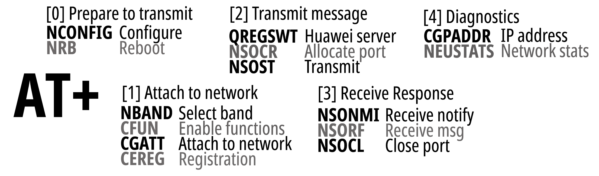

## [0] Prepare to transmit

First we reboot the Quectel module to start from a fresh, clean state…

| AT Commands (in bold) | Remarks |
| :--- | :--- |
| | |
|  `Boot: Unsigned` <br>   `Security B.. Verified` <br>   `Protocol A.. Verified` <br>   `Apps A...... Verified` <br>  ` ` <br>   `REBOOT_CAUSE_SECURITY_RESET_PIN` <br>   `Neul` <br>   `OK` <br> | When connected to our computer, the Quectel module shows `REBOOT_CAUSE_SECURITY_RESET_PIN`. This is normal. <br><br> Ignore the `ERROR` message that may appear at the beginning. The Blue Pill program attempts a few retries until it gets the `OK` response. |
| **`AT+NCONFIG=AUTOCONNECT,FALSE`** | Disable auto-connecting to the NB-IoT network upon restarting |
| `OK` | This enables us to specify which NB-IoT Band to search, which should be faster |
| **`AT+NRB`** | Reboot the module |
|  `REBOOTING` <br>   `-f-f�-f` <br>   `-f�` <br>   `Boot:Unsigned` <br>   `SecurityB..Verified` <br>   `ProtocolA..Verified` <br>   `AppsA......Verified` <br>   `REBOOT_CAUSE_APPLICATION_AT` <br>   `Neul` <br>   `OK` <br> | Module reboots |

## [1] Attach to network

After rebooting, we specify the network settings and attach to the NB-IoT network…

| AT Commands (in bold) | Remarks |
| :--- | :--- |
| **`AT+NBAND=8`** | Select NB-IoT Band 8 |
| `OK` | This is specific to your NB-IoT operator |
| **`AT+CFUN=1`** | Enable full functionality |
| `OK` | Now we may start attaching to the network |
| **`AT+CGATT=1`** | Attach to the NB-IoT network |
| `OK` | Attach operation begins |
| **`AT+CEREG?`** | Are we registered to the NB-IoT network? |
| `=+CEREG:0,1` <br> `OK` | `0,1` means we have been registered <br> `0,2` means we should wait a few seconds then recheck via `AT+CEREG?` |
| **`AT+CGATT?`** | Are we attached to the NB-IoT network? |
| `=+CGATT:1` <br> `OK` | `1` means we are attached to the NB-IoT network. Ready to transmit. |

## [2] Transmit message

We are now ready to transmit. For the specific AT command for transmitting our message, look in the [CoAP Message Encoder Google Sheet](https://docs.google.com/spreadsheets/d/1k72R9CWKxu8_AsQURA3iOtTTlE08Qks0gFcuBJZtTqo/edit?usp=sharing).

| AT Commands (in bold) | Remarks |
| :--- | :--- |
| **`AT+QREGSWT=2`** | Don't use Huawei IoT Server. Note: This command has been moved to the above section |
| `OK` | |
| **`AT+NSOCR=DGRAM,17,0,1`** | Allocate a local network port. `DGRAM,17` means UDP, `0` means allocate a new port, `1` means allow receiving of messages from server |
| `1` <br> `OK` | `1` is the local port allocated |
| **`AT+NSOST=1,104.199.85.211,5683,147,`** _(data omitted)_ **`,100`**  | Transmit the CoAP UDP packet using local port `1` to server IP address `104.199.85.211`, server port `5683` with size `147` bytes and msg sequence `100`. Use the AT command from the Google Sheet |
| `1,147` <br> `OK` | `1` is the local port |
| | `147` is the number of bytes being transmitted |
| `=+NSOSTR:1,100,1` | `1,100,1` means port `1`, msg sequence `100` was transmitted (`1`) |

## [3] Receive response

The CoAP Server at thethings.io returns a response to our message…

| AT Commands (in bold) | Remarks |
| :--- | :--- |
| | |
| `=+NSONMI:1,35` | `1,35` means port `1` has received a server response of `35` bytes |
| **`AT+NSORF=1,35`** | Read the server response for port `1`, returning `35` bytes |
| `1,104.199.85.211,5683,35,58410001` <br> `0000164A272AE239C132FF7B227374617` <br> `47573223A2263726561746564227D,0` <br> `OK` | Server response for port `1`, server IP address `104.199.85.211`, server port `5683` |
| **`AT+NSOCL=1`** | Close port 1 |
| `OK` | |

We may use Wireshark to decode the above server response (which is another CoAP message)…

```
58 41 00 01 00 00 16 4A 27 2A E2 39 C1
32 FF 7B 22 73 74 61 74 75 73 22 3A 22
63 72 65 61 74 65 64 22 7D
```

See the section _“Advanced Topic: What’s Inside The CoAP Message?”_ in _“[Connect STM32 Blue Pill to ESP8266 with Apache Mynewt](https://medium.com/@ly.lee/connect-stm32-blue-pill-to-esp8266-with-apache-mynewt-7edceb9e3b8d)”_

Insert a space between each byte before decoding with Wireshark. The decoded response from thethings.io should read…

```
{"status":"created"}
```

Which means that the Thing State has been successfully updated in thethings.io.

## [4] Diagnostics

Here are some AT commands useful for troubleshooting…

| AT Commands (in bold) | Remarks |
| :--- | :--- |
| **`AT+CGPADDR`** | Display the IP address allocated by the network |
| `=+CGPADDR:0,10.26.255.38` `OK` | IP address of the module |
| **`AT+NUESTATS`** | Display the network statistics |
|  `Signal power:-758` <br>   `Total power:-706` <br>   `TX power:230` <br>   `TX time:438` <br>   `RX time:16193` <br>   `Cell ID:3535136` <br>   `ECL:0` <br>   `SNR:132` <br>   `EARFCN:3518` <br>   `PCI:22` <br>   `RSRQ:-108` <br>   `OPERATOR MODE:4` <br>   `OK` <br>  | Network statistics of the module |

[Read more about Quectel NB-IoT AT Commands](https://medium.com/@ly.lee/connect-stm32-blue-pill-to-nb-iot-with-quectel-bc95-g-and-apache-mynewt-c99a9d8417a9?source=friends_link&sk=34fb9befbea42e98cb5942d66f594027).

# Configuring the CoAP Server at thethings.io

Upon clicking the URL `https://blue-pill-geolocate.appspot.com/?device=5cfca8c…` that’s shown in the Blue Pill log, we’ll see a web page that displays the temperature received by the server at thethings.io.

The server has converted the raw temperature into degrees Celsius. We convert the temperature at the server to conserve RAM and ROM on Blue Pill.

The temperature data appears in a web page like this (it refreshes every 10 seconds)…

 <br>
_Display of sensor data received from our Blue Pill_

How did the sensor data get posted on a public website that’s outside thethings.io?

That’s my demo server hosted at Google Cloud running AppEngine Go. Here's what just happened…

1. Recall that the Program Settings in [targets/bluepill_my_sensor/syscfg.yml](https://github.com/lupyuen/stm32bluepill-mynewt-sensor/blob/nbiot/targets/bluepill_my_sensor/syscfg.yml) includes a `COAP_URI` setting

1. The `COAP_URI` setting includes a Thing Token for thethings.io: `IVRiBC...`

1. This Thing Token refers to a specific Thing in my thethings.io account. What sensor data are we sending to the Thing?

1. We are sending the temperature data plus a `device` field. 

    `device` is a random Device ID generated by our program. When my CoAP Server at thethings.io receives the `device` and `t` fields, it pushes the two values to my Google Cloud server, along with the computed floating-point temperature. (Yes it’s possible with thethings.io Cloud Code!)

1. Then when you click the URL in the Blue Pill log...

    `https://blue-pill-geolocate.appspot.com/?device=5cfca8c…` 

    The Device ID appears inside the URL, so my Google Cloud server renders the computed temperature value associated with your Blue Pill. That’s the power of end-to-end IoT Integration with Quectel modules, NB-IoT, thethings.io and Google Cloud!

    For the purpose of NB-IoT Education I’ll allow you to send CoAP messages to my (personal, paid, non-sponsored) account at thethings.io… because there’s no better way to learn CoAP!

💎 If you wish to create your own free account for thethings.io, check the section [_“Configuring the CoAP Server at thethings.io”_ in this article](https://medium.com/@ly.lee/build-your-iot-sensor-network-stm32-blue-pill-nrf24l01-esp8266-apache-mynewt-thethings-io-ca7486523f5d). Copy your Thing Token to the `COAP_URI` setting.

Open the Developer’s Console in thethings.io. Updates to the Thing State triggered by CoAP messages will be shown here.
You will not longer be able to view the sensor data on my Google Cloud server, but you may follow the instructions in the above article to view your sensor data in thethings.io dashboards. 

The integration code for thethings.io and Google Cloud is available at...

github.com/lupyuen/thethingsio-wifi-geolocation

github.com/lupyuen/gcloud-wifi-geolocation

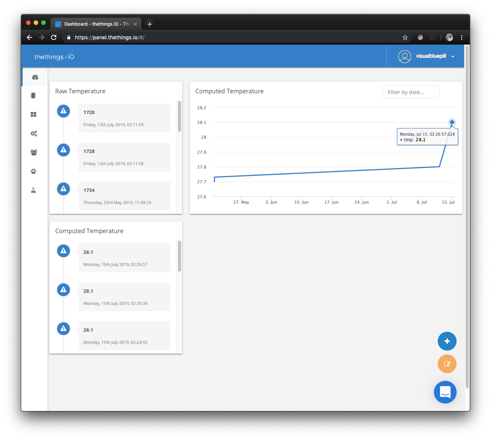 <br>
_thethings.io Dashboard with Raw Temperature `t` and Computed Temperature `tmp`_

# Typeless Rust

To making coding easier for beginners, the extension generates [Typeless Rust code like this](https://github.com/lupyuen/stm32bluepill-mynewt-sensor/blob/rust-nbiot/rust/visual/src/lib.rs)...

```rust
#[infer_type]  //  Infer the missing types
fn start_sensor_listener(sensor_name: _, sensor_key: _, sensor_type: _, poll_time: _) ...
    //  Call Mynewt API
    sensor::set_poll_rate_ms(sensor_name, poll_time) ? ;
```

When the typeless code is compiled, the [`infer_type` Procedural Macro](https://github.com/lupyuen/stm32bluepill-mynewt-sensor/blob/rust-nbiot/rust/macros/src/infer_type.rs) infers the types by matching the variables against the Mynewt API...

```rust
//  Call Mynewt API
sensor::set_poll_rate_ms(sensor_name, poll_time) ? ;  
//  `sensor_name` inferred as type `&Strn`
//  `poll_time`   inferred as type `u32`
```

The macro then injects the inferred types into the typeless code...

```rust
fn start_sensor_listener(sensor_name: &Strn, sensor_key: &'static Strn,
                         sensor_type: sensor_type_t, poll_time: u32) ...
```

The inferred types are stored in [`infer.json`](https://github.com/lupyuen/stm32bluepill-mynewt-sensor/blob/rust-nbiot/infer.json). The enables the `infer_type` macro to infer new types based on types already inferred for other functions...

```json
    "start_sensor_listener": [
        [ "sensor_name", "&Strn" ],
        [ "sensor_key",  "&'static Strn" ],
        [ "sensor_type", "sensor_type_t" ],
        [ "poll_time",   "u32" ]
    ],
    "send_sensor_data": [
        [ "sensor_data", "&SensorValue" ]
    ],
    "handle_sensor_data": [
        [ "sensor_data", "&SensorValue" ]
    ]
```

This diagram illustrates the Type Inference…

 <br>
_How the infer_type macro infers missing types_

Here’s an animation (done with Visual Studio Code) that explains how the types were inferred by the `infer_type` macro. At top left are the types to be inferred. At bottom left are the known type signatures from the Mynewt API.

The `infer_type` macro scans the Typeless Rust program recursively, hence we see the roving red highlight. When the macro finds a match with the Mynewt API, the code flashes green.

Green ticks at the top left mean that we have successfully inferred the types.

The recursive Rust code parsing was implemented with the excellent `syn` crate. The `quote` crate was used to emit the transformed Rust code.

[微博视频](https://weibo.com/7285313566/I2N12aA4W)

[YouTube Video](https://youtu.be/1SCLlwK5KwE)

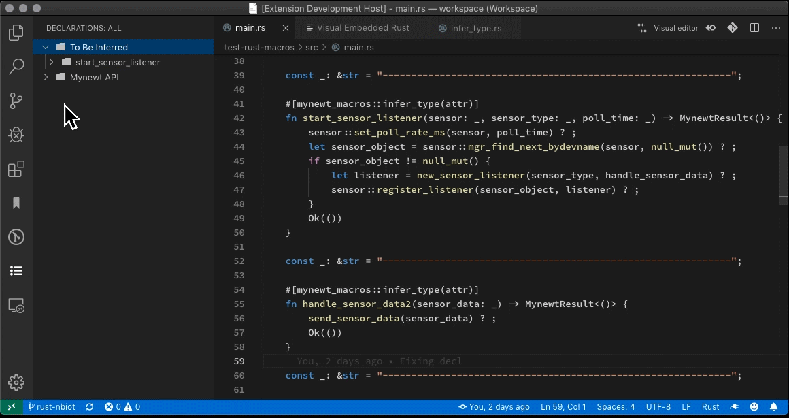 <br>
_How the infer_type macro infers missing types, animated in Visual Studio Code with the Visual Embedded Rust Extension_

More details in the article [_"Advanced Topics for Visual Embedded Rust Programming"_](https://medium.com/@ly.lee/advanced-topics-for-visual-embedded-rust-programming-ebf1627fe397?source=friends_link&sk=01f0ae0e1b82efa9fd6b8e5616c736af)

# How Small Is Rust?

Here’s the RAM and ROM usage of the Visual Embedded Rust firmware on Blue Pill. The left section shows Rust and Apache Mynewt functions sorted by size (largest on top). The right section shows the total RAM and ROM used by each library.

Our firmware occupies 55 KB of ROM and 13 KB of RAM, out of Blue Pill’s 64 KB ROM and 20 KB RAM. (That’s __86% of ROM__ and __65% of RAM__ used)

[The spreadsheet below](https://docs.google.com/spreadsheets/d/1zIDfQmRcQ_wxGIPsq7MOxk7XzBO5-TL9R25TSFxaopU/edit#gid=381366828&fvid=1643056349) was generated based on the [Linker Memory Map](https://github.com/lupyuen/stm32bluepill-mynewt-sensor/blob/rust-nbiot/logs/my_sensor_app.elf.map) created during the firmware build. [Read more about memory maps](https://medium.com/@ly.lee/stm32-blue-pill-analyse-and-optimise-your-ram-and-rom-9fc805e16ed7)

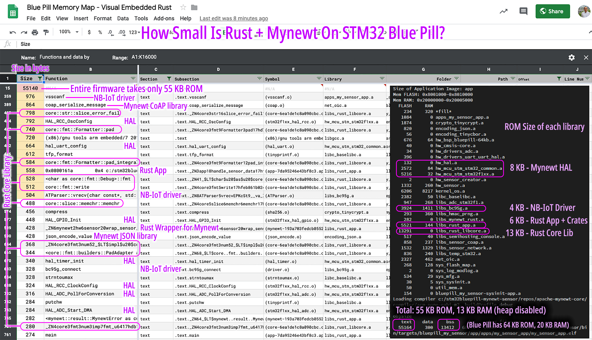 <br>
_RAM and ROM usage of the Visual Embedded Rust firmware_

# Why Blue Pill? Power vs Price Compromise

| | |
|:- |:- |
| 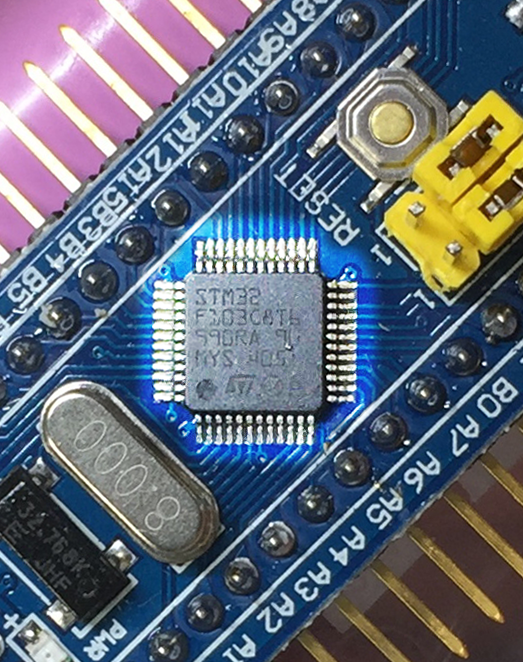 <br> _STMicroelectronics STM32F103C8T6 microcontroller on Blue Pill_ | Blue Pill was chosen for the tutorial because it best represents a real-world, low-cost microcontroller with limited RAM and ROM. <br><br> The microcontroller is found in many off-the-shelf products, even [flying drones](https://timakro.de/blog/bare-metal-stm32-programming/)! <br><br> To be clear what’s a “Blue Pill”… The heart of Blue Pill is an STMicroelectronics __STM32F103C8T6__ microcontroller. <br><br> That’s a tiny module surface-mounted on a Blue printed-circuit board (hence the name Blue Pill). Without the Blue (and Yellow) parts, it would be extremely difficult for us to experiment with the microcontroller. So we buy a Blue Pill and use it like an Arduino. |

| | |
|:- |:- |
| 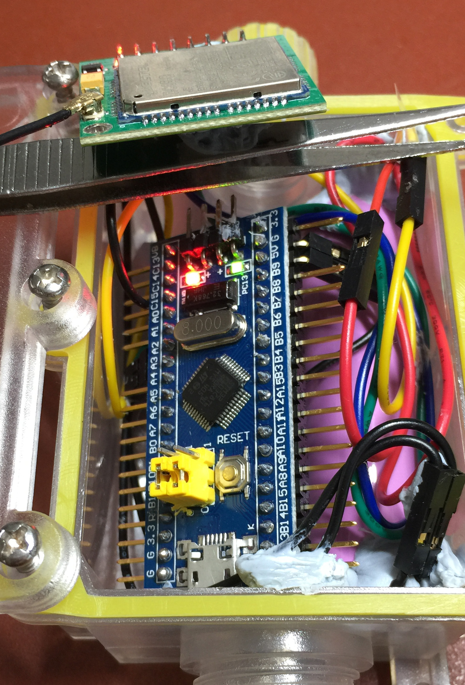 | Thus Blue Pill is clearly a Developer Kit that marks up the cost of the microcontroller. Blue Pill retails for $2, but the STM32F103C8T6 microcontroller [sells for only 40 cents](https://s.taobao.com/search?ie=utf8&initiative_id=staobaoz_20190817&stats_click=search_radio_all%3A1&js=1&imgfile=&q=stm32f103c8t6%E8%8A%AF%E7%89%87&suggest=0_1&_input_charset=utf-8&wq=STM32F103C8T6&suggest_query=STM32F103C8T6&source=suggest)! _Perfect for creating millions and millions of IoT sensors!_ <br><br> _(Actually a $2 dev kit is so affordable that it begs you to go ahead and do [many](https://www.linkedin.com/posts/lupyuen_nbiot-stm32-quectel-activity-6562722168394878976-0ld5) [many](https://www.linkedin.com/posts/lupyuen_stm32-quectel-nbiot-activity-6558570814986387456-ajVF) crazy things with it!)_ <br><br> At this price we get a 32-bit Arm processor with many goodies (GPIO, UART, I2C, SPI, USB, …) But the catch: It has only __64 KB of ROM and 20 KB of RAM.__ _([Similar to the Apple II](https://en.wikipedia.org/wiki/Apple_II_Plus)!)_ <br><br> With Blue Pill’s extremely limited RAM and ROM, we can’t code in decent programming languages like MicroPython and JavaScript (for MakeCode, which I tried and failed). <br><br> C was the only option… Until Rust came along! Rust is a systems programming language that’s as low level as C (i.e. no garbage collection). Yet it solves the painful pointer problem in C. |

[This research paper presents an excellent comparison of C with Rust](https://mssun.me/assets/ares19securing.pdf)

[Read more about Blue Pill and the upgraded version, Super Blue Pill](https://medium.com/swlh/super-blue-pill-like-stm32-blue-pill-but-better-6d341d9347da)

# Why Apache Mynewt? Evolution of Rust on Bare Metal

Why are we running the Apache Mynewt realtime operating system on Blue Pill together with Rust? Mynewt was built with C (and therefore susceptible to C defects)… _Why not run Rust on Blue Pill without C?_

This means we would be running Rust on __“Bare Metal”__, without any other operating system. In fact, Rust becomes the operating system. Rust would have to handle GPIO, UART, I2C, SPI, USB, … Plus multitasking and related functions like semaphores and messages queues.

Why reinvent the Rusty wheel when we already have realtime operating systems like Mynewt, FreeRTOS, Zephyr, …? It takes a lot of effort to build a new realtime operating system in Rust that supports all kinds of microcontrollers.

There’s a great team hard at work creating the [Embedded Rust platform](https://rust-embedded.github.io/book/intro/index.html). In the meantime, I’m taking a shortcut and using Mynewt… But in a safe way, with __Safe Wrappers__.

I’m not solving the problem of devices crashing due to bugs in the operating system… Because I trust experienced C coders in the Mynewt community for creating high-quality kernel code. Instead I’m solving the problem of devices crashing due to bugs in the C application code… And experienced C application coders are really hard to find.

Can we solve this problem with Rust?

# How Safe Is Rust? Safe Wrappers for Mynewt

Rust won’t let us use pointers freely like in C (unless we explicitly write `unsafe` code). Mynewt however is written in C and it will blindly accept any pointer we pass, even bad ones. How shall we reconcile the two?

The solution: Create __Safe Wrappers__ that validate all pointers passed from Rust to Mynewt and vice versa. A Safe Wrapper is a Rust function that wraps around the Mynewt API, converting the unsafe Mynewt API into a safe Rust API.

For example: When a Mynewt API accepts a string input (`const char *`), we wrap the API with a Rust function that accepts a `Strn` type instead.

`Strn` is a type I created that represents a null-terminated string. Unlike C, Rust strings are not expected to be terminated by the null byte. So when we pass strings to the Safe Wrapper as `Strn`, the wrapper verifies that the string is indeed terminated by a null.

When Mynewt returns a string, the Safe Wrapper also uses the `Strn` type to verify that the returned string is properly terminated by null.

Read more about Mynewt Safe Wrappers in the section _“[Advanced Topic: Safe Wrappers for Mynewt](https://medium.com/@ly.lee/rust-rocks-nb-iot-stm32-blue-pill-with-quectel-bc95-g-on-apache-mynewt-ef62a7e28f7e)”_

[Read this excellent paper that compares Unsafe Coding in C with Safe Coding in Rust](https://mssun.me/assets/ares19securing.pdf)

# What’s Wrong With Rust? Types!

In C we would manipulate a string as `char *`. In Rust it weirdly becomes `&'static Strn`… a reference to a static null-terminated string. (`Strn` is my own helper type for embedded platforms.) Yes Rust is 100% precise in describing types… perhaps too precise?

Many Rust learners struggle with Rust Types _(I’m still struggling)_. The Rust Compiler helpfully suggests how to fix coding issues with types. If the Rust Compiler is really so smart, why not go all the way and __fix the types for us?__

Thus Visual Embedded Rust becomes an experiment in “__Typeless Rust__”. Visual Coding doesn’t give us much room to express precise types in our Visual Programs. (How would you visually represent a _reference to a static null-terminated string?_) And if Visual Rust is meant for beginners, maybe we shouldn’t even mention types, to flatten the Rust learning curve.

Rust Learners shall stroll up the Rust learning slope starting with…

1. __Visual Rust,__ devoid of types, followed by…

1. __Typeless Rust,__ the typeless code generated by Visual Rust, and finally…

1. __Fully-Typed Rust,__ a.k.a. Rust 2018

# Inside The Visual Embedded Rust Extension for Visual Studio Code

The source code for the Visual Embedded Rust extension is located at github.com/lupyuen/visual-embedded-rust

The extension is published in the [Visual Studio Marketplace here](https://marketplace.visualstudio.com/items?itemName=LeeLupYuen.visual-embedded-rust&ssr=false#overview)

The extension wraps the web-based visual code editor from [Google Blockly](https://developers.google.com/blockly/guides/overview) into a [VSCode WebView](https://code.visualstudio.com/api/extension-guides/webview). Blockly uses XML to represent a visual program.

The extension is activated when we [edit a Rust source file](https://github.com/lupyuen/visual-embedded-rust/blob/master/package.json#L41-L49) (`*.rs`). [Here’s a sample Rust source file containing a Visual Program](https://github.com/lupyuen/stm32bluepill-mynewt-sensor/blob/rust-nbiot/rust/visual/src/lib.rs)

There are two parts of the file…

1. __Rust Source Code:__ Which is autogenerated by the Blockly Code Generator from the Blockly XML

1. __Blockly XML:__ The XML representation of the visual program. It’s located at the bottom of the source file, marked by `BEGIN BLOCKS … END BLOCKS`

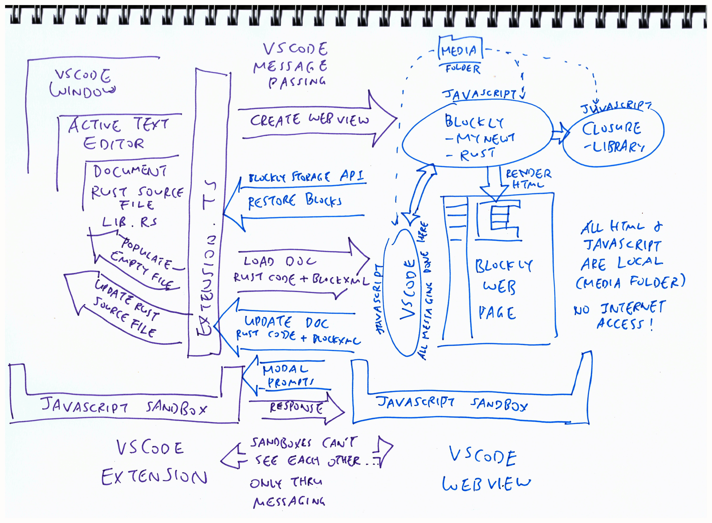 <br>
_Logic Flow in the Visual Embedded Rust Extension_

1. Main logic for the VSCode Extension is in [extension.ts](https://github.com/lupyuen/visual-embedded-rust/blob/master/src/extension.ts)

    The extension contains two asset folders:

    [`resources`](https://github.com/lupyuen/visual-embedded-rust/tree/master/resources): Contains a [visual program template](https://github.com/lupyuen/visual-embedded-rust/blob/master/resources/template.rs) that will be used to populate empty Rust source files

    [`media`](https://github.com/lupyuen/visual-embedded-rust/tree/master/media): Contains the Blockly JavaScript code that will be embedded in the WebView to render the visual editor and generate Rust source code…

    [`media/blockly-mynewt-rust`](https://github.com/lupyuen/blockly-mynewt-rust) contains the Blockly JavaScript code with a custom Rust Code Generator

    [`media/closure-library`](https://github.com/google/closure-library) is the Google Closure Library needed by Blockly

    [`media/vscode`](https://github.com/lupyuen/visual-embedded-rust/tree/master/media/vscode) contains JavaScript code that enables VSCode Message Passing in the WebView to implement save/load functions and modal prompts 

1. The extension creates a [WebView that embeds the HTML and JavaScript code](https://github.com/lupyuen/visual-embedded-rust/blob/master/src/extension.ts#L88-L144) from [Google Blockly](https://developers.google.com/blockly/guides/overview).

    [HTML code for the WebView is here](https://github.com/lupyuen/visual-embedded-rust/blob/master/src/web.ts)

1. The VSCode Extension and the WebView are running in [separate JavaScript sandboxes](https://code.visualstudio.com/api/extension-guides/webview#scripts-and-message-passing).

    Hence we’ll be using VSCode Message Passing to communicate between the VSCode Extension and WebView, as we shall soon see…

1. [When the WebView loads](https://github.com/lupyuen/visual-embedded-rust/blob/master/media/vscode/storage.js#L59-L71), it notifies the VSCode Extension to fetch the contents of the Rust source file.

    The VSCode Extension responds by [passing the contents of the active Rust source file to the WebView](https://github.com/lupyuen/visual-embedded-rust/blob/master/src/extension.ts#L168-L186) via Message Passing.

    The WebView [extracts the Blockly XML](https://github.com/lupyuen/visual-embedded-rust/blob/master/media/vscode/message.js#L40-L60) embedded in the file contents ([at the bottom](https://github.com/lupyuen/stm32bluepill-mynewt-sensor/blob/rust-nbiot/rust/visual/src/lib.rs#L159)). The WebView refreshes the Blockly workspace with the Blockly XML.

    If the active Rust source file is empty, the VSCode Extension [populates the file](https://github.com/lupyuen/visual-embedded-rust/blob/master/src/extension.ts#L155-L202) with a [template containing Blockly XML](https://github.com/lupyuen/visual-embedded-rust/blob/master/resources/template.rs)

1. When the [visual program is updated](https://github.com/lupyuen/visual-embedded-rust/blob/master/media/vscode/storage.js#L194-L207), the WebView sends the [updated Blockly XML and the generated Rust code](https://github.com/lupyuen/visual-embedded-rust/blob/master/media/vscode/message.js#L79-L89) (via [Message Passing](https://github.com/lupyuen/visual-embedded-rust/blob/master/media/vscode/storage.js#L187-L192)) to the VSCode Extension.

    The extension [updates the Rust document](https://github.com/lupyuen/visual-embedded-rust/blob/master/src/extension.ts#L203-L223) in VSCode with the Blockly XML and generated Rust Code.

1. The custom-built Rust Code Generator for Blockly is here…

    github.com/lupyuen/blockly-mynewt-rust/blob/master/generators/rust.js

    github.com/lupyuen/blockly-mynewt-rust/tree/master/generators/rust

    The Rust Code Generator for Blockly is [explained in this article](https://medium.com/@ly.lee/visual-programming-with-embedded-rust-yes-we-can-with-apache-mynewt-and-google-blockly-8b67ef7412d7)

# Building The Visual Embedded Rust Extension

To build the extension, two repositories need to be cloned into the media folder: [`blockly-mynewt-rust`](https://github.com/lupyuen/blockly-mynewt-rust) and [`closure-library`](https://github.com/google/closure-library):

```bash
cd media
git clone https://github.com/lupyuen/blockly-mynewt-rust
git clone https://github.com/google/closure-library
```

# References

The following files may be useful for reference…

- [Disassembly of the Rust Application build](https://github.com/lupyuen/stm32bluepill-mynewt-sensor/blob/rust-nbiot/logs/libapp-demangle.S)

- [Disassembly of the Rust Crates](https://github.com/lupyuen/stm32bluepill-mynewt-sensor/blob/rust-nbiot/logs/rustlib-demangle.S)

- [Disassembly of the entire firmware](https://github.com/lupyuen/stm32bluepill-mynewt-sensor/blob/rust-nbiot/logs/my_sensor_app.elf.lst)

- [Memory map of the firmware](https://github.com/lupyuen/stm32bluepill-mynewt-sensor/blob/rust-nbiot/logs/my_sensor_app.elf.map)

[Read more about hosting Rust applications on Mynewt](https://medium.com/@ly.lee/hosting-embedded-rust-apps-on-apache-mynewt-with-stm32-blue-pill-c86b119fe5f?source=friends_link&sk=f58f4cf6c608fded4b354063e474a93b)


# Release Notes

For changelog refer to...

1.  [`github.com/lupyuen/visual-embedded-rust/commits/master`](https://github.com/lupyuen/visual-embedded-rust/commits/master)

1.  [`github.com/lupyuen/blockly-mynewt-rust/commits/master`](https://github.com/lupyuen/blockly-mynewt-rust/commits/master)

1.  [`github.com/lupyuen/stm32bluepill-mynewt-sensor/commits/rust-nbiot`](https://github.com/lupyuen/stm32bluepill-mynewt-sensor/commits/rust-nbiot)
